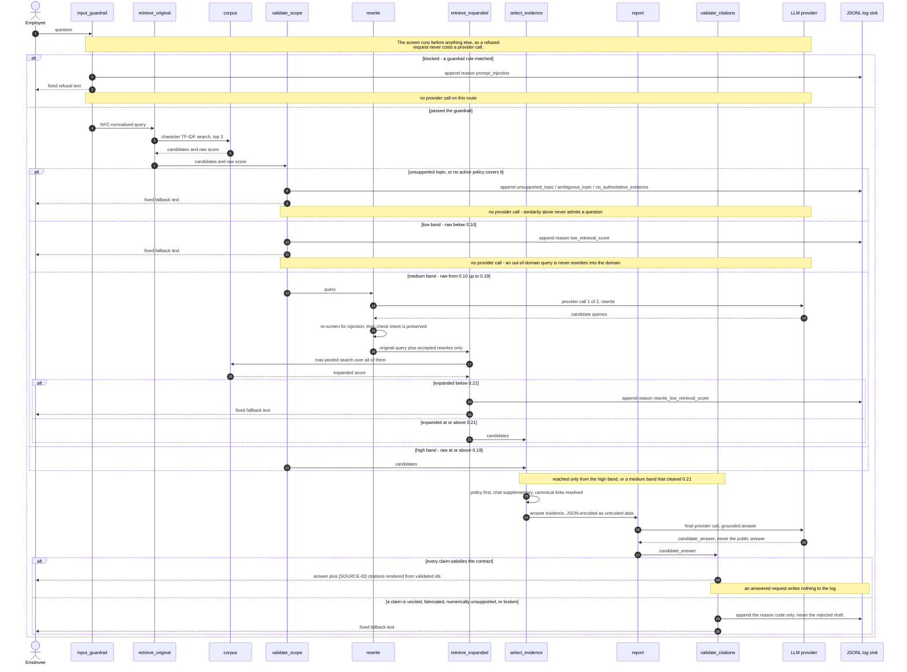

# Design — decisions, authority model, security and logging in full

> Moved out of `README.md` so the submission brief stays readable in ten
> minutes. Nothing here was cut; the README keeps a summary of each topic and
> links to the section below that carries the full argument.
>
> Back to [README](../README.md) · engineering contract in [AGENTS.md](../AGENTS.md)
> · worked examples in [demo.md](demo.md)

## Contents

1. [Requirement traceability](#requirement-traceability)
2. [Policy authority versus chat recall](#policy-authority-versus-chat-recall)
3. [Design decisions](#design-decisions)
4. [One request, end to end](#one-request-end-to-end)
5. [Security posture, and where it stops](#security-posture-and-where-it-stops)
6. [Logging and privacy](#logging-and-privacy)
7. [Configuration](#configuration)
8. [Repository map](#repository-map)
9. [Remaining known limitations](#remaining-known-limitations)
10. [Seams, not stubs](#seams-not-stubs)
11. [Production sketches — designed, not built](#production-sketches--designed-not-built)

---

## Requirement traceability


The assignment asks for a small Python RAG/agent prototype over a mock corpus of
company documents, with a guardrail layer, source attribution, and a logged
fallback path. Requirements are summarised in my own words below; the source
brief is confidential and is not reproduced or included in this repository.

| Requirement | Where it is implemented | What proves it |
|---|---|---|
| **1. Data ingestion** — 5–10 mock documents mixing clear procedural policy with short, noisy chat messages containing slang, typos, and ambiguous content | [`data/docs/`](../data/docs/) — 8 Markdown files, 5 `policy` + 3 `chat`, loaded by [`src/ingestion/loader.py`](../src/ingestion/loader.py) | [`tests/test_loader.py`](../tests/test_loader.py) — all 8 load, duplicate `source_id` fails, missing title fails, `authority` must agree with `source_type`; the loaded index is shown in [the console](screenshots/ui_10_console_kb.png) |
| **2a. Retrieval and generation pipeline** | [`src/graph.py`](../src/graph.py) — 10 nodes, 18 edges, 5 routes; retrieval in [`src/retrievers/local_tfidf.py`](../src/retrievers/local_tfidf.py), generation in [`src/agents/reporter.py`](../src/agents/reporter.py) | [`tests/test_graph.py`](../tests/test_graph.py) — every route asserted, including the LLM call count per route; [`tests/test_retrieval.py`](../tests/test_retrieval.py) for exact, typo, and out-of-domain queries |
| **2b. Guardrail / validation layer** — out-of-scope questions and prompt injection are declined politely | [`src/guardrails/input_guardrail.py`](../src/guardrails/input_guardrail.py) (13 named rules), [`src/guardrails/scope_validator.py`](../src/guardrails/scope_validator.py) (topic gate); refusal wording in [`src/fallback.py`](../src/fallback.py) | [`tests/test_guardrail.py`](../tests/test_guardrail.py) and [`tests/test_scope_validator.py`](../tests/test_scope_validator.py); measured as Injection Block Rate 21/21 **and** Benign Pass Rate 21/21 in [`eval/RESULTS.md`](../eval/RESULTS.md); the refusal an employee actually sees is [this screenshot](screenshots/ui_04_blocked.png) |
| **2c. Source attribution** — every answer names its document | [`src/guardrails/citation_validator.py`](../src/guardrails/citation_validator.py) validates, [`src/answer_renderer.py`](../src/answer_renderer.py) renders the markup | [`tests/test_citations.py`](../tests/test_citations.py); Citation Provenance Validity Rate 23/23 in [`eval/RESULTS.md`](../eval/RESULTS.md); worked output in [Demo](demo.md#the-six-examples), rendered as per-claim chips and expandable evidence in [the answer card](screenshots/ui_02_answered.png) |
| **3. Evaluation and fallback** — when the system finds nothing, or the *confidence score* falls below a threshold, reply with a prepared fallback message and log that question for later analysis | Thresholds in [`src/config.py`](../src/config.py), fallback texts in [`src/fallback.py`](../src/fallback.py), JSONL writer in [`src/logging_utils.py`](../src/logging_utils.py) | [`tests/test_fallback.py`](../tests/test_fallback.py), [`tests/test_logging_utils.py`](../tests/test_logging_utils.py); harness in [`eval/run_eval.py`](../eval/run_eval.py), results in [`eval/RESULTS.md`](../eval/RESULTS.md); a real log line is shown in [section 11](#logging-and-privacy), and the operator's view of that log — reason codes, scores, and the resulting corpus backlog — in [the audit console](demo.md#7-the-audit-console-where-requirement-3-becomes-inspectable) |
| **D. Deliverables** — runnable repo with `requirements.txt` and a setup README | [`requirements.txt`](../requirements.txt) (9 pinned direct dependencies), [Quick start](../README.md#2-quick-start) | The Quick start commands were run end to end in a fresh virtualenv on Python 3.11.15; the resulting output is [`eval/RESULTS.md`](../eval/RESULTS.md) |

**One word in requirement 3 is deliberately not the word this system uses:
*confidence score*.** The gate the brief asks for is here and is the three-band
router in [section 5](../README.md#3-architecture) — the quantity it compares is
`raw_retrieval_score` (and `expanded_retrieval_score` after a rewrite) against
`REWRITE_FLOOR` 0.10, `DIRECT_ANSWER_THRESHOLD` 0.19, and
`FINAL_ANSWER_THRESHOLD` 0.21, each calibrated and traced to its evidence in
[section 12](#configuration). Below the threshold, the request gets the
prepared fallback message and a JSONL record. What the number is *called*
differs on purpose: a cosine similarity of 0.22 is not a 22% chance the answer
is right, and labelling it a confidence would invite exactly that reading, so it
is named a retrieval similarity heuristic everywhere it is shown
([section 8](#design-decisions)). Same gate the brief describes, a name that
does not overclaim.

**What here goes beyond the brief, and why.** Three things were added as
engineering judgement, not as requirements, and a reviewer should be able to tell
them apart. First, **policy authority is separated from chat recall**: the brief
asks for a corpus that mixes both, and answering a rule from a colleague's chat
message is the obvious failure that mix invites, so a normative answer now
requires an active policy document behind it ([section 7](#policy-authority-versus-chat-recall)).
Second, **the model's output is a candidate, not an answer**: it is validated
claim by claim before any text is rendered, which is what makes "every answer
cites a source" an enforced property instead of a prompt instruction
([section 9](../README.md#6-scope-and-what-a-citation-proves)). Third, **a supported-topic gate sits
in front of the score**, because retrieval similarity cannot distinguish a
question the corpus answers from one it merely resembles
([section 6](../README.md#6-scope-and-what-a-citation-proves)).

---

## Policy authority versus chat recall

The corpus deliberately mixes two kinds of document, and they are not
interchangeable.

| `source_type` | `authority` | Role |
|---|---|---|
| `policy` | `authoritative` | May establish a rule |
| `chat` | `supplementary` | May improve recall; may never be the only source of a rule |

The whole corpus is eight files in [`data/docs/`](../data/docs/):

| `source_id` | Title | Type | Topics |
|---|---|---|---|
| [`FIN-001`](../data/docs/FIN-001_reimbursement_process.md) | ขั้นตอนการเบิกค่าใช้จ่าย | `policy` | `reimbursement_process` |
| [`FIN-002`](../data/docs/FIN-002_receipt_policy.md) | นโยบายใบเสร็จและเอกสารประกอบการเบิก | `policy` | `receipt_policy`, `reimbursement_process` |
| [`HR-001`](../data/docs/HR-001_annual_leave.md) | ระเบียบการลาพักร้อน | `policy` | `annual_leave` |
| [`HR-002`](../data/docs/HR-002_sick_leave.md) | ระเบียบการลาป่วย | `policy` | `sick_leave` |
| [`HR-003`](../data/docs/HR-003_wfh_policy.md) | นโยบายการทำงานจากที่บ้าน | `policy` | `work_from_home` |
| [`CHAT-001`](../data/docs/CHAT-001_reimbursement_slang.md) | แชตสอบถามการเบิกค่าแท็กซี่หลังทำ OT | `chat` | `reimbursement_process`, `receipt_policy` |
| [`CHAT-002`](../data/docs/CHAT-002_leave_typo.md) | แชตสอบถามวิธีกดลาพักร้อนใน HR Portal | `chat` | `annual_leave` |
| [`CHAT-003`](../data/docs/CHAT-003_ambiguous_expense.md) | แชตสอบถามการเคลมค่าที่จอดรถกรณีใบเสร็จหาย | `chat` | `reimbursement_process`, `receipt_policy` |

The chat documents are where the noise lives, on purpose. `CHAT-001` writes
`เบิกตังค่า taxi` for what the policy calls การเบิกค่าใช้จ่าย. `CHAT-002`
misspells ลาพักร้อน as `ลาพักรอ้น` and ขอบคุณ as `ขอบคุน`. And `CHAT-003` is
deliberately **unresolved**: an employee lost a parking receipt, Finance says a
declaration form covers amounts under 500 baht, then says this particular
automated-kiosk case needs a manager's decision and promises to answer tomorrow.
An answer built on that thread alone would state a rule Finance never actually
gave — which is the concrete reason the next paragraph exists.

Authority comes from frontmatter metadata that the loader cross-validates at
start-up — never from the model, never inferred from document text. Every chat
document declares `canonical_source_ids` pointing at the policies it discusses;
`CHAT-001`, for example, links to `FIN-001` and `FIN-002`.

The consequence at runtime: when a chat transcript is the top hit, the evidence
selector resolves its canonical policy into the answer evidence and keeps the
chat only alongside it. If no active policy covers the query's topic, the request
falls back with `no_authoritative_evidence` rather than answering from a
colleague's recollection. A linked policy carries no similarity score of its own,
because it was never ranked by retrieval — the UI labels it as such rather than
inventing a number for it.

---

## Design decisions

Six choices shaped this prototype more than any others. Each is stated the same
way: the situation, the options, what was chosen, what it costs, and what would
make me change my mind.

**Character n-gram TF-IDF rather than word tokenisation.** Thai is written
without spaces between words, so a word-level analyser needs a segmenter, and a
segmenter is one more dependency that fails in exactly the place this corpus is
hardest — the chat transcripts, where `ลาพักรอ้น` and `ใบเสด` are misspelled.
The options were a Thai word segmenter plus word TF-IDF, or character n-grams
with no segmentation at all. Character (2,5) n-grams won because a typo still
shares most of its n-grams with the correct spelling: `ลาพักรอ้น` retrieves
`HR-001` at 0.2303 with no spelling correction anywhere in the pipeline. That
claim is now measured rather than argued from that one case — `--perturb` injects
one, two and three single-character Thai typos under a fixed seed and Hit@3 does
not move on any split (`eval/RESULTS.md`); what does move is the route, on two
cases whose score falls under a threshold while the right document is still
retrieved. The cost
is that the score is pure surface overlap, so two texts about different things
that share vocabulary score highly — which is exactly the hole the scope gate in
[section 6](../README.md#6-scope-and-what-a-citation-proves) exists to plug. I would revisit
this the moment the corpus grows past a few dozen documents, where lexical
collisions stop being manageable.

**No embeddings and no vector database, deliberately.** With eight documents, an
embedding index would add an API dependency or a model download, a similarity
space nobody can inspect by eye, and no measurable recall benefit — Retrieval
Hit@3 is already 16/16 on calibration and 7/7 on held-out. The options were
embeddings plus a vector store, a hybrid of BM25 and dense retrieval, or staying
lexical. Staying lexical also keeps the whole retrieval path runnable with no
credential, which is what makes the offline test suite and the zero-key demo
routes possible at all. The cost is real and is the first limitation listed in
[section 14](../README.md#7-limitations-and-production-next-steps): there is no semantic matching, so a
correctly-phrased question using vocabulary absent from the corpus will miss. The
seam is ready — `Retriever` is a protocol in
[`src/retrievers/base.py`](../src/retrievers/base.py), so a dense backend is a new
class rather than an edit to routing.

**Rewriting adaptively, not on every query.** The obvious design rewrites every
incoming question to normalise it. That is wrong here for two reasons: it pays a
provider call on questions that already retrieve perfectly well, and — worse — it
lets the model drag an out-of-domain question *into* the domain, because a
rewriter asked to produce a good HR query will produce one no matter what it was
given. The options were rewrite-always, rewrite-never, or rewrite only in a
calibrated middle band. The band won: below 0.10 the question falls back
untouched, above 0.19 it never needed help. The cost is a threshold pair that has
to be maintained, and a medium band whose behaviour depends on live model output
— demonstrated concretely in [section 4](demo.md#the-six-examples), where the
same slang query answered once and fell back twice. I would change this if
rewrite recovery on the medium band stopped justifying the second call.

**Retrieving whole documents rather than chunks.** Every corpus document is
short enough to fit comfortably in one prompt, so chunking would buy nothing and
cost the thing that matters most here: a chunk needs a hierarchical citation id,
and `[FIN-001]` is a citation an employee can actually go and read. The options
were fixed-size chunks, section-level chunks, or whole documents. The cost is
that this does not survive a 40-page policy PDF, where a whole-document citation
stops being useful evidence and the prompt stops fitting. That is the point at
which chunking with hierarchical ids becomes necessary, and it is listed as such
in [section 15](../README.md#7-limitations-and-production-next-steps).

**Treating the score as a heuristic, never as a confidence.** A cosine similarity
of 0.22 is not a 22% chance the answer is right, and presenting it that way
invites exactly the wrong decision from whoever reads it. The options were
displaying a confidence percentage, hiding the number entirely, or showing it and
naming it honestly. It is shown and labelled *"Retrieval similarity score
(heuristic)"* in the CLI and the console, and never converted to a percentage.
The cost is that a reviewer cannot read answer quality off the number — which is
true of the underlying quantity, so the display is not hiding anything the metric
had. Calibrating the score into a probability would need labelled outcome data
this prototype does not have.

**Separating policy authority from chat recall.** The brief's corpus mixes formal
procedure with colleagues answering each other, and the tempting design treats
them as one pile of text. The failure that invites is specific: retrieval finds
the chat message, the model answers from it, and an employee acts on a
colleague's half-remembered version of a rule. The options were weighting chat
lower, excluding chat from retrieval, or admitting chat to retrieval but never
letting it establish a rule alone. The third won, because excluding chat throws
away the recall it provides — `CHAT-001` is where the 22:00 OT cut-off is
explained in the words an employee would actually use. Authority is metadata the
loader cross-validates, never a model judgement. The cost is that the corpus now
carries `authority`, `status`, and `canonical_source_ids` frontmatter that has to
be maintained; [section 7](#policy-authority-versus-chat-recall) covers the
mechanics.

---

## One request, end to end

The same graph seen as a lifecycle. The `Note over` bands mark where no provider
call happens, and each branch shows when the JSONL append occurs:



Eight of the ten graph nodes appear as lifelines. The other two, `refuse` and
`fallback`, are the paired *"append reason"* and *"fixed text"* messages: both
nodes do exactly those two things and nothing else, so giving them their own
lifelines would widen the diagram without adding a step.

The Reporter writes `candidate_answer`, never `answer`. Only the validation node
promotes a candidate, and it renders the public text itself from validated source
IDs, so no unvalidated model output can reach an employee, a log, or the returned
state.

---

---

## Security posture, and where it stops

The whole screen lives in
[`src/guardrails/input_guardrail.py`](../src/guardrails/input_guardrail.py) and is
exercised by [`tests/test_guardrail.py`](../tests/test_guardrail.py), where every
rule is paired with a benign counter-example by `rule_id`.

| Layer | What it does | What it does not do |
|---|---|---|
| Input guardrail | 13 named regex rules screen the query before the first LLM call | Detect novel phrasings, or anything semantic |
| Rewrite re-screen | The same screen runs again on every model-generated rewrite candidate | Prevent a model from being confused by benign-looking text |
| Evidence encoding | Retrieved text is `json.dumps`-encoded into the human message; the system prompt declares those values untrusted data | Solve indirect prompt injection |
| Output validation | Claims are validated against the evidence ID set, its policy subset, and the figures the cited documents actually state | Verify that a claim is true |

Matching runs on hardened foldings of the input — NFKC, separator folding, case
folding — and on **two** treatments of zero-width characters rather than one.
Deleting them rejoins `Ig<ZWSP>nore`, but it also glues `ignore<ZWSP>previous`
into a single token that no longer offers the whitespace gap the rule requires;
folding them to a space does exactly the reverse. Both foldings are built and a
rule fires if either hits, so the attacker's choice of hiding place does not
decide the outcome. The folding recomposes Thai SARA AM explicitly, because NFKC
splits it and NFC does not put it back; without that repair every Thai rule
stops matching.

**The regex screen is a precision-first prototype safeguard, not
defence-in-depth.** It is measured on 21 curated attacks and 21 benign
lookalikes, each rule paired with a benign counter-example so a new pattern
cannot raise the block rate by breaking legitimate queries. `Injection Block
Rate: 21/21` is a statement about those 21 cases and nothing else. Novel
phrasings will pass it — and a phrasing being *canonical* is no guarantee it is
covered: the article in "ignore **the** previous instructions" was missing from
the determiner slot until it was added here, and the guardrail set reported a
perfect score throughout — 16/16 on the 32-case fixture of the time — because
every fixture was written in the wording its own rule was built from. The cases
that would have caught it are in the set now, which is part of why it holds 42.

JSON encoding contains **delimiter breakout** — a document carrying a literal
`</SOURCE>` can no longer close its own record. It does not contain **indirect
prompt injection**: a poisoned document whose text argues persuasively to the
model remains an open problem that encoding cannot solve. Production defences
(layered classifier, policy engine, content provenance) are listed in section 15.

Secrets are read from the environment through `config.py`, which exposes presence
(`has_llm_credential()`) and never the value. Presence is checked lazily at the
`src/agents` boundary; a missing key raises `MissingLlmCredentialError` before a
client exists. No API key, system prompt, or provider payload reaches the state,
the log, the UI, the CLI, or any exception message.

---

## Logging and privacy

Every blocked and fallback event appends one JSON object to
`logs/fallback_queries.jsonl`:

```json
{
  "timestamp": "2026-08-20T14:30:00+07:00",
  "query": "...",
  "reason": "low_retrieval_score",
  "raw_retrieval_score": 0.06,
  "expanded_retrieval_score": null,
  "top_sources": ["HR-003"],
  "rewritten_queries": [],
  "alias_query_count": 0,
  "scope_topics": [],
  "scope_reason": null,
  "latency_ms": 118,
  "llm_calls": 0
}
```

`scope_topics` and `scope_reason` record what the scope gate resolved, beside
rather than inside `reason`. `reason` names the gate that actually stopped the
request — an in-domain question whose raw score never cleared the rewrite floor
is logged as `low_retrieval_score` on purpose — so these two fields are what let
a report group by topic without a routing rule being rewritten to suit it. Both
are empty on a route that never reached the gate, such as a blocked request.

Twenty-one reason codes are defined as an enum in
[`src/fallback.py`](../src/fallback.py); ad-hoc strings are not permitted, and the
complete set is:

| Stage | Reason codes |
|---|---|
| Input validation | `prompt_injection`, `invalid_query_type`, `empty_query`, `query_too_long` |
| Scope and authority | `unsupported_topic`, `ambiguous_topic`, `no_authoritative_evidence` |
| Retrieval score | `low_retrieval_score`, `rewrite_low_retrieval_score` |
| Rewrite | `rewrite_failure`, `rewrite_rejected` |
| Answer service | `llm_not_configured`, `reporter_failure` |
| Request budget | `request_deadline_exceeded` |
| Deterministic stage crash | `retrieval_failure`, `evidence_failure` |
| Answer contract | `missing_citation`, `fabricated_citation`, `invalid_answer_structure`, `insufficient_reporter_evidence`, `unsupported_numeric_claim` |

Several of these exist specifically so a degraded request is not mislabelled.
Six of them -- `llm_not_configured`, `reporter_failure`, `rewrite_failure`,
`retrieval_failure`, `evidence_failure` and `request_deadline_exceeded` -- name a
stage that could not run, so `src/fallback.py` answers them with the
service-unavailable text instead of the insufficient-evidence one: an employee
told that no policy was found would go and ask HR about a rule the pipeline never
read. `rewrite_rejected` is not in that family and keeps the evidence wording,
because there the rewriter worked and the deterministic validator refused its
output; it separates "every rewrite drifted" from "the corpus does not have
this".

`ambiguous_topic` is the third wording, and the only one that asks the employee
for something. It is recorded when a query touches at least two supported topics
above `SCOPE_AMBIGUOUS_MIN_SCORE` without resolving any of them — `ลาได้กี่วัน`,
"how many days of leave can I take", which names no leave type — and its text
asks which one was meant instead of reporting a gap the corpus may not have.
Unlike `unsupported_topic` it is not gated on the rewrite floor: an unfinished
question is short and vague, so it almost always scores low, and behind that gate
the code could never be recorded at all. Nothing about the routing changes — the
request still falls back with zero LLM calls — which is why the exception is
safe to make for wording and would not be for a verdict.
For reporting rather than routing, `reason_family()` in the same module groups
every code into one of four families — `knowledge_gap`, `service_failure`,
`security_or_invalid_input`, `validation_failure` — each implying a different
owner: a document somebody has to write, an operational incident, an input the
screen refused, and a contract this repository owns rejecting model output. The
codes themselves never collapse; the families exist so the console's triage panel
and any later warehouse query can rank causes without hard-coding a code list
that a new member would silently fall out of. A test asserts the mapping is total
in both directions, and that the service family is exactly the set behind the
service-unavailable wording, so a request told the service is down cannot be
counted as a missing document.

Only *executed* rewrites are logged — a candidate the validator rejected is model
output about the user's question and never enters the record. The same holds for
a rejected candidate answer: the log carries its reason code, never its text.

**Writes are best-effort but not silent.** `log_fallback_event` returns a
`LogWriteResult`, the graph stores the outcome as `telemetry_logged`, and the
response text claims a recorded question only when the append actually happened.
A broken sink degrades the wording; it never becomes the fallback reason, because
a full disk did not change why the request lost its answer.

**Reading back is bounded.** `read_recent_events` tails only the newest rows in
64 KiB blocks instead of loading the file, drops the possibly-truncated first
line of the window, and counts a partial final line rather than rendering it.

**The persistent log is hidden by default.** The sink holds raw employee
questions from every past session, so `read_persistent_events` refuses to open it
unless `ENABLE_OPS_VIEW` is explicitly enabled (committed default: `false`). With
the flag off, past sessions' questions do not enter the process at all. The gate
lives in `src/`, not in `app.py`, because who may read the sink is a property of
the data rather than of one UI.

> **`ENABLE_OPS_VIEW` is a demo switch, not authentication and not RBAC.** It is
> process-wide and unauthenticated: anyone who can reach the Streamlit port while
> it is enabled sees every logged question. There are no users, no roles, no
> per-document ACLs, and no audit trail of who read what. The employee page and
> the console are separated as information architecture, not as access control,
> and both rails say so on screen.

Full query text is logged because the assignment requires unanswered-question
logging. The corpus and demo queries are mock data; this schema would need PII
redaction, a retention policy, and encryption at rest before it touched real
employee questions.

---

## Configuration

All settings are read from the environment through `src/config.py`, the single
source of truth. `.env.example` carries placeholders and the derivation of every
calibrated number; `.env` is git-ignored and never committed.

| Variable | Default | Meaning |
|---|---:|---|
| `OPENAI_API_KEY` | — | Checked lazily at the LLM boundary, never at start-up |
| `MODEL_NAME` | `gpt-5-mini` | Reporter and Rewriter model |
| `TEMPERATURE` | `0` | Determinism first |
| `LLM_TIMEOUT_SECONDS` / `LLM_MAX_RETRIES` | `30` / `2` | Client hardening |
| `REWRITE_FLOOR` | `0.10` | Below this, fall back without rewriting |
| `DIRECT_ANSWER_THRESHOLD` | `0.19` | At or above this, answer directly |
| `FINAL_ANSWER_THRESHOLD` | `0.21` | Minimum expanded score after a rewrite |
| `SCOPE_MATCH_THRESHOLD` | `0.40` | Alias containment needed to claim a topic |
| `SCOPE_AMBIGUOUS_MIN_SCORE` | `0.11` | Second-topic score above which a refusal is reported as under-specified |
| `REWRITE_CONTINUITY_THRESHOLD` | `0.05` | Minimum lexical continuity of an accepted rewrite |
| `TOP_K` | `3` | Retrieved candidates |
| `MAX_QUERY_CHARS` | `500` | Input length limit |
| `CORPUS_DIR` | `data/docs` | Corpus location |
| `FALLBACK_LOG_PATH` | `logs/fallback_queries.jsonl` | Telemetry sink |
| `ENABLE_OPS_VIEW` | `false` | Demo-only persistent audit surface |

Thresholds come from calibration, never from intuition, and
[`src/config.py`](../src/config.py) is the single source of truth — no number is
written inline anywhere else, and the UI reads these values rather than defining
its own. The provenance of each, from the 2026-08-20 sweep over
[`eval/retrieval_calibration.json`](../eval/retrieval_calibration.json):

| Threshold | Value | Why this number |
|---|---:|---|
| `REWRITE_FLOOR` | 0.10 | The widest observed gap in the calibration set: generic out-of-domain queries top out at raw **0.0858**, while the weakest answerable case scores **0.1187**. The floor sits between them, so an out-of-domain question is never rewritten into the domain. |
| `DIRECT_ANSWER_THRESHOLD` | 0.19 | The salary hard negative scores raw **0.1773**; the next answerable case scores **0.1972**. Answering directly starts above the hard negative. |
| `FINAL_ANSWER_THRESHOLD` | 0.21 | Recalibrated down from 0.24 once the scope gate took over hard-negative rejection. At 0.24 the weakest answerable slang case (expanded **0.2176**) was indistinguishable from the salary hard negative (**0.2152**) and lost its answer. At 0.21 calibration coverage is 16/16 with precision still 16/16 on the 25-case split, and 0.21 stays above the highest expanded score seen for an unsupported in-domain case (**0.1884**). The trade-off is explicit: precision on this band now rests on the scope gate, so weakening the scope catalog would weaken this threshold too. |
| `SCOPE_MATCH_THRESHOLD` | 0.40 | Every answerable case resolves its topic at **0.5714** or above (the weakest is the `ลาพักรอ้น` typo; exact and slang aliases score 1.0000), while the strongest case that must *not* resolve scores **0.1667**. 0.40 sits near the midpoint of that gap. |
| `SCOPE_AMBIGUOUS_MIN_SCORE` | 0.11 | Separates an unfinished question from an out-of-domain one, on the **second-best** topic score rather than the best: one partial match is a coincidence, two are an ambiguity. Measured 2026-08-22 on calibration, near-domain and 23 probe queries — the strongest second-best score of an out-of-domain query is **0.0833**, the under-specified calibration case scores **0.1333**, and 0.11 is the midpoint. Precision-first: "what documents do I need" sits just below at **0.1034** and keeps the generic wording. |
| `REWRITE_CONTINUITY_THRESHOLD` | 0.05 | Valid normalisations in [`eval/rewrite_cases.json`](../eval/rewrite_cases.json) score **0.0756** to **0.3178**; a rewrite that replaces the question wholesale scores **0.0086** or less. This is a floor against wholesale replacement only — drift that stays lexically close, such as 500 baht becoming 5,000, is caught by the anchor and topic rules instead. |

Held-out data was not consulted for any of these numbers. A boolean flag is
parsed strictly, so a typo such as `ENABLE_OPS_VIEW=treu` fails the import rather
than resolving to the permissive value.

**The score is a similarity heuristic, not a probability.** It is labelled that
way in the CLI and the UI, and it is never presented as a confidence percentage.

---

## Repository map

```text
├── app.py                     # Streamlit entry point — page composition only
├── ui/                        # Streamlit presentation layer (ui -> src, never back)
│   ├── labels.py              # User-facing strings and display constants
│   ├── styles.py              # Design-system stylesheets
│   ├── formatting.py          # Pure value -> markup functions (unit-tested)
│   ├── runtime.py             # Cached graph, retriever, session record
│   ├── assistant.py           # Employee page
│   └── console.py             # Operations and audit page
├── main.py                    # CLI entry point — argument parsing only
├── src/
│   ├── config.py              # Typed settings loaded from env, single source
│   ├── schemas.py             # Document, RetrievedDocument, PipelineState, Route
│   ├── graph.py               # LangGraph nodes + edges + routing functions
│   ├── fallback.py            # Fixed fallback/refusal texts + reason codes
│   ├── evidence_selector.py   # Policy-first answer-evidence selection
│   ├── answer_renderer.py     # Validated claims -> public answer text
│   ├── logging_utils.py       # JSONL telemetry: append writer + bounded reader
│   ├── agents/                # The only modules that may call an LLM
│   ├── guardrails/            # Input screen, scope, rewrite, citation validation
│   ├── ingestion/loader.py    # Markdown + YAML frontmatter → Document
│   └── retrievers/            # Character TF-IDF index + cosine scoring
├── data/docs/                 # 8 mock documents (Thai content, English filenames)
├── docs/screenshots/          # Streamlit captures used in section 4 (real runs, not mockups)
├── eval/                      # Calibration / held-out / guardrail sets + runner
├── logs/                      # Runtime JSONL output (git-ignored except .gitkeep)
└── tests/                     # Offline unit + graph route tests
```

Start with [`AGENTS.md`](../AGENTS.md) section 2 for the architecture contract,
[`src/graph.py`](../src/graph.py) for the routes, and
[`tests/test_graph.py`](../tests/test_graph.py) for the executable specification of
every branch above. The corpus itself is worth two minutes:
[`data/docs/`](../data/docs/) holds five policy documents and three chat transcripts
— [`CHAT-003`](../data/docs/CHAT-003_ambiguous_expense.md) is the deliberately
ambiguous one, where Finance says a lost receipt under 500 baht can use a
declaration form but defers the actual case to a manager.

---

## Remaining known limitations

The README carries the limitations a reviewer must see in the first ten minutes.
These are the rest — real, and narrower.

* **The rewrite validator tolerates anchor deletion, and that is deliberate.**
  The anchor rule is one-sided: a candidate may not *add* a figure the employee
  never wrote — 500 baht becoming 5,000 is refused — but it may leave one out,
  so a question about two days of annual leave may be rewritten into a question
  about filing annual leave. Turning the rule into an equality check would
  refuse the generalizing rewrites the model actually produces, and the blast
  radius it would be buying protection against is small for two structural
  reasons: the original query is searched beside every rewrite, so the search
  cannot lose what the employee wrote, and the reporter is handed the original
  query rather than the rewrite
  ([`src/graph.py`](../src/graph.py), `report_node`), so no figure reaches an
  answer through a rewrite at all. What deletion could still cost is ranking, so
  it is measured rather than argued about: `RewriteValidationResult` carries
  `dropped_anchor_count`, a diagnostic no route reads and nothing logs. Its
  value across every shipped fixture is currently **0** — no medium-band query
  in [`eval/cached_rewrites.json`](../eval/cached_rewrites.json) carries a
  figure at all, so today the tolerance is latent rather than exercised, which
  is also why enforcing it now would be a change no set can measure. A soft
  rule becomes justified the day an answer error in
  [`eval/ANSWER_RESULTS.md`](../eval/ANSWER_RESULTS.md) traces back to a rewrite
  that dropped an anchor; Fact-Citation Alignment is 52/52 and none does.
* **`telemetry_logged` reports one append attempt.** It does not prove the record
  is still on disk, and nothing detects a sink truncated between runs. The
  bounded reader counts malformed lines inside the read window only.
* **The Ops / Audit console is a demo surface, not an observability stack.** It
  reads this process's own session state and, when `ENABLE_OPS_VIEW` is on, tails
  the local JSONL file. There are no metrics backend, no traces, no alerting, no
  retention, and no aggregation across processes or restarts; the figures it
  shows under *Evaluation* are transcribed from committed files rather than
  measured live, and it says so on screen.
* **Lazy credential validation moves the failure later by design.** `--check`
  mitigates it, but an operator who never runs it meets a missing key at the
  first LLM-bound question.
* **Structured Reporter output adds a provider-side schema failure mode.** It
  degrades to `reporter_failure` and is covered by a test, but it is a new way
  for a request to lose its answer.
* **Model-output screening for accidental system-prompt disclosure is not
  implemented.** A broad output regex would cost precision on legitimate answers,
  so no reason code was added for a behaviour that does not exist.
* **The retrieval score is not a calibrated probability of answer correctness.**
  It orders candidates and feeds three thresholds; turning it into a probability
  would need labelled outcome data this prototype does not have.

---

## Seams, not stubs

| Seam | Prototype | Production path |
|---|---|---|
| `Retriever` protocol | character TF-IDF | see the escalation table below |
| Retrieval unit | whole document | chunking with hierarchical citation IDs |
| Scope gate | closed alias catalog | facet-based gate, default-deny on eligibility, coverage metadata in document frontmatter — [sketched below](#facet-based-scope-gate) |
| Answer validation | provenance + coverage + numeric consistency + fact containment | claim entailment model or LLM-as-judge faithfulness pass |
| `config.py` | env vars | secret manager, per-tenant configuration |
| `logging_utils` | JSONL file | structured logging → OpenTelemetry → warehouse, with PII redaction and retention |
| Guardrail module | regex screen | layered classifier + policy engine + indirect-injection defences |
| Entry points | CLI + Streamlit | FastAPI service, authn/authz, per-user document ACLs |
| Policy lifecycle | `status: active` flag | `effective_from/to`, `owner`, `version`, `supersedes`; startup fails on conflicting active policies — [sketched below](#policy-lifecycle-governance) |
| Evaluation | static JSON sets | CI-gated regression suite, production sampling |

---

## Production sketches — designed, not built

Two production steps are specified far enough here that building them is
engineering rather than design, and are then deliberately **not** built. Both
would change how requests are refused, which means re-calibrating a gate the
whole precision story rests on; a prototype that ships the sketch and keeps the
measured behaviour is more honest than one that ships a bigger mechanism nobody
has calibrated.

### Facet-based scope gate

The scope gate today is a closed alias catalog per *topic*. Its known hole is
stated in [section 6 of the README](../README.md#6-scope-and-what-a-citation-proves):
an expense item nobody thought to list can still reach the answer route on the
reimbursement **process** policy, which explains how to file a claim and says
nothing about which items qualify. Seventeen unsupported topics are listed by
hand today, and every one of them was added after somebody noticed the hole it
left.

The production shape replaces "which topic is this about" with "which *facet*
does this ask for", and defaults eligibility to deny:

```yaml
# data/docs/FIN-001_expense_process.md frontmatter, extended
covers:
  - facet: reimbursement.filing_procedure     # how to file
    kind: procedure
  - facet: reimbursement.taxi_after_ot        # this item is claimable
    kind: eligibility
  - facet: reimbursement.parking_client_visit
    kind: eligibility
```

* **Facets, not topics.** `reimbursement.taxi_after_ot`,
  `receipt.missing_receipt_exception`, `annual_leave.notice_period`,
  `sick_leave.medical_certificate_threshold`, `wfh.days_per_week`. A facet is
  one question a document actually answers, so coverage becomes a property of
  the corpus rather than a list maintained beside it.
* **Default-deny on eligibility.** A question classified as *eligibility* whose
  facet no active document declares is refused, whatever it scores. That is the
  rule the current catalog approximates by naming the seventeen items it happens
  to know about; it is also the rule that removes the maintenance burden, since
  a new expense item is refused by default instead of by being remembered.
* **Procedure questions keep the current behaviour.** "How do I file a claim" is
  answerable from the process policy for any item, and must not inherit the
  eligibility default, or the assistant stops being useful.
* **The classifier is the hard part.** Separating eligibility from procedure is
  a second deterministic gate at minimum, and it is where the design would first
  need labelled data — the current catalog needs none.

**What would trigger building it.** Any one of: the unsupported catalog passing
roughly thirty entries, or needing an edit more than once a month; the corpus
passing roughly fifty documents, where per-item aliases stop being reviewable;
or one near-domain miss reaching production — an eligibility question answered
from a process document, which the `scope_topics` field now in the JSONL sink
makes visible in the log rather than only in an eval set.

**Why it is not in this repository.** It re-calibrates `SCOPE_MATCH_THRESHOLD`
across the whole system and puts Benign Pass Rate at risk, and the measured
alternative already holds: 14/14 near-domain hard negatives refused with 6/6
benign twins still answered. Shipping an uncalibrated gate to close a hole the
current one demonstrably closes on the measured set would trade evidence for
architecture.

### Policy lifecycle governance

`status: active` is the whole lifecycle model today: a retired document stays in
the corpus for provenance and never supports an answer. That is enough for eight
documents written on one day and nothing like enough for a real policy set, where
the dangerous failure is not a missing rule but **two rules that both look
current**.

```yaml
# frontmatter, extended
version: 3
effective_from: 2026-01-01
effective_to: null          # null = still in force
owner: hr-policy@example.com
supersedes: HR-001@v2
```

* **`effective_from` / `effective_to`** turn "active" into a question about a
  date rather than a flag somebody has to remember to flip. A request answered
  today must not cite a policy that took effect tomorrow.
* **`supersedes`** makes replacement explicit, so the retired version stays
  citable for an audit of a past decision without being reachable by a new one.
* **`owner`** is who to ask when two documents disagree — the field that makes
  the conflict actionable rather than merely detected.
* **Start-up validation, not runtime.** Two active documents covering the same
  facet with overlapping effective dates is a corpus defect, and the loader
  already fails the import on duplicate ids and missing titles
  ([`src/ingestion/loader.py`](../src/ingestion/loader.py)). This belongs in the
  same place: a deployment that cannot decide which rule is current should not
  start, rather than answer half its requests from the old one.
* **A corpus checksum per deployment.** `eval/RESULTS.md` already records the
  SHA-256 of `data/docs/*.md` for the measured run, which is how a reader knows
  which corpus a metric describes. In production the same digest belongs in the
  telemetry of every request, so an answer can be tied to the exact corpus that
  produced it after the corpus has moved on.

**What would trigger building it.** The first real policy update — that is, the
first time a document is replaced rather than added. Until then there is no
lifecycle to govern, and the fields would be metadata nobody maintains.
